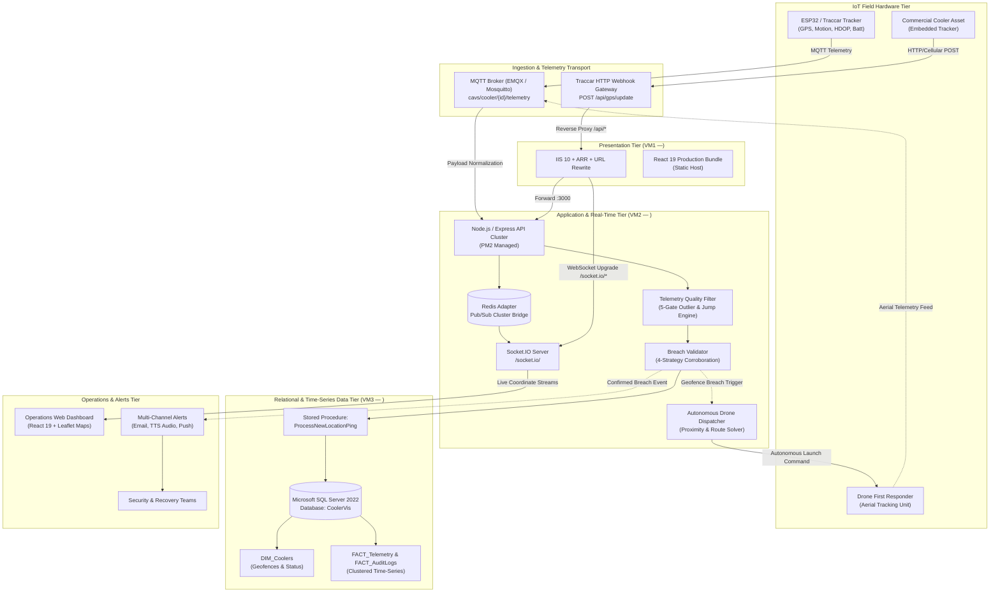

# CoolerTrack / CAVS (Cooler Asset Visibility System)

> **Enterprise IoT Fleet Tracking, Geofence Enforcement & Autonomous Drone First-Response**

>**Code available for walkthrough on request"**

CoolerTrack is a mission-critical IoT asset tracking and visibility platform built to monitor, secure, and manage commercial refrigeration fleets deployed across geographically dispersed contractor and retail partner locations. It solves the costly problems of asset theft, unauthorized relocation, and inventory spoilage by providing sub-meter location visibility, intelligent sensor-corroborated perimeter defense, and automated real-time incident alerting.

---

##  System Architecture

CoolerTrack operates on an enterprise 3-tier, high-availability architecture with edge reverse-proxying, an event-driven Node.js ingestion pipeline, Redis Pub/Sub cluster coordination, and an MS SQL Server time-series datastore.



---

##  Key Engineering Decisions

### 1. GPS Smoothing & Telemetry Noise Filtering
Field IoT GPS units suffer from multipath reflections, satellite geometry degradation (high HDOP), and urban canyon drift. CoolerTrack addresses this through a dual-stage filtering engine:

* **Weighted Moving Average (WMA) & Accuracy Weighting:**
  Position pings are normalized using reciprocal accuracy weighting:
  $$\text{Weight} = \frac{1}{\max(\text{Accuracy}_{\text{meters}}, 5)}$$
  High-confidence pings dominate coordinate calculation, smoothing out high-frequency jitter while preserving true displacement.
* **5-Gate Outlier & Teleportation Rejection (`telemetryFilter.js`):**
  Incoming packets must pass five sequential gates before ingestion:
  1. **Coordinate Boundary Gate:** Validates latitude/longitude within physical Earth ranges $(-90 \le \text{lat} \le 90, -180 \le \text{lng} \le 180)$.
  2. **Accuracy Gate:** Rejects pings exceeding `GPS_MAX_ACCURACY_METERS` (default $>65\text{ m}$).
  3. **HDOP Geometry Gate:** Discards fixes with Horizontal Dilution of Precision $>3.0$.
  4. **Velocity Gate (Teleportation Guard):** Calculates implied speed between the incoming fix and recent historical anchors. Any velocity exceeding $120\text{ km/h}$ is rejected as anomalous.
  5. **Dynamic Jump Gate:** Evaluates displacement against a sliding anchor window ($N=5$). Stationary devices jumping $>200\text{ m}$ in $\le 180\text{ s}$ are suppressed as multipath spikes.
* **Quality Scoring Engine:** Every accepted ping receives a quality score $(0.0\text{ to }1.0)$ persisted to `FACT_Telemetry` for auditability and predictive maintenance.

---

### 2. Multi-Strategy Breach Validation & Alert De-Duplication
Triggering emergency alerts on single-point GPS drift damages operator trust. CoolerTrack implements a 4-strategy corroboration engine (`breachValidator.js`):

* **Strategy 4 — Accuracy-Aware Dynamic Geofence Radius:**
  Instead of a rigid boundary, the effective perimeter expands dynamically to absorb sensor uncertainty:
  $$\text{Effective Radius} = \text{Base Radius} + \min(\text{GPS Accuracy}, \text{Max Buffer})$$
  This eliminates false alarms caused by satellite drift near boundary edges.
* **Strategy 1 — Physical Motion Sensor Gate:**
  Coolers equipped with onboard accelerometers/vibration sensors require physical motion confirmation (`motion: true`). If a cooler reports coordinates outside the fence while reporting stationary vibration state, the breach is suppressed (`MOTION_SENSOR_STATIONARY`).
* **Strategy 2 — Speed Gate Fallback:**
  When hardware motion sensors are absent, the system falls back to GPS Doppler speed analysis (`stationarySpeedKph: 3.0 km/h`).
* **Strategy 3 — Temporal Persistence & Dwell-Time Confirmation:**
  A breach must persist for $N$ consecutive pings (`BREACH_CONFIRM_PINGS = 3`) before escalation. Transient spikes trigger an internal `AWAITING_CONFIRMATION` state without sounding alarms.
* **Alert De-Duplication & State Edge Triggering:**
  Alerts fire **strictly on state transitions** (`breachStarted = isBreach && !wasBreach`). Once a cooler enters a breached state, high-frequency pings update map coordinates without generating duplicate email or auditory alerts.
* **Lifecycle Gating & Settle Drift Warnings:**
  Perimeters are automatically disarmed during approved lifecycles (`maintenance`, `deploying`, `decommissioned`). Coolers in `settled_pending` (new installations awaiting lock) trigger non-critical drift warnings rather than security theft alarms.

---

### 3. Reconnect Resilience & Map Viewport Stabilization (Recent Updates)
In distributed enterprise deployments behind reverse proxies (IIS with ARR), network drops and tab un-focusing can destabilize WebSockets and DOM tile rendering. The system incorporates targeted resilience patterns:

* **Ref-Stabilized Socket Architecture (`useSocket.js`):**
  Event handlers and callbacks are encapsulated in stable React `useRef` containers. This eliminates socket recreation cycles and reconnect thrashing when parent dashboard states update.
* **Smart Backoff & Auto-Reconnect:**
  Socket.IO clients employ dual-transport fallback (`websocket`, `polling`) with capped exponential backoff (`reconnectionDelayMax: 3000ms`, `timeout: 10000ms`), automatically re-authenticating with Bearer tokens upon reconnect.
* **3-Pass Viewport Settling Engine (`MapView.js`):**
  Resolves the persistent issue of blank map tiles or missing geofence layers caused by asynchronous CSS rendering under IIS reverse proxies:
  * **Pass 1 (400ms):** Initial sizing pass to request correct tile dimensions as the DOM settles.
  * **Pass 2 (900ms):** Corrects flexbox layout shifts and modal animation transitions.
  * **Pass 3 (1800ms):** Catch-all pass for high-latency network rendering.
* **Connection-Driven Map Sync:**
  Reconnection events trigger `mapInstanceRef.current.invalidateSize({ animate: false })` to instantly re-align SVG overlay coordinates with current canvas dimensions.

---

##  Drone First-Response Extension (Prototype)

An autonomous perimeter security extension for high-value cooler assets and high-risk commercial zones:

```
[Geofence Breach Event] ──► [Nearest Drone Selection] ──► [Autonomous Launch]
                                                                  │
[Continuous Coverage]  ◄── [Battery Relay Hand-Off]  ◄── [Live Aerial Tracking]
```

* **Autonomous Dispatch:**
  When `breachValidator` confirms an unauthorized geofence breach (`CONFIRMED_BREACH`), the backend dispatches an autonomous aerial drone from the nearest docking station based on real-time station availability, battery charge, and Haversine proximity calculations.
* **Aerial Tracking & Telemetry Loop:**
  The drone engages the target using onboard computer vision and RTK-GPS coordinates. Live aerial coordinates, altitude, and video stream telemetry are ingested back into the CoolerTrack ingestion pipeline (`cavs/drone/{id}/telemetry`), superimposing high-resolution aerial tracking over the dashboard map.
* **Continuous Coverage Relay Network:**
  To mitigate flight-time limitations (typically 25–40 minutes per drone), the system orchestrates a coordinated handoff protocol. When a primary drone reaches $25\%$ battery capacity, the dispatch engine pre-launches a secondary drone to intercept the target vector. Upon visual handoff confirmation, the primary drone returns to its autonomous docking station for inductive recharging.

---

##  Technology Stack

| Layer | Technologies |
|---|---|
| **IoT & Edge Hardware** | ESP32, Traccar GPS, Accelerometers, MQTT / HTTP Gateways |
| **Ingestion & Backend** | Node.js, Express, Socket.IO, Redis Pub/Sub, Winston Logger |
| **Database** | Microsoft SQL Server 2022 (`DIM_Coolers`, `FACT_Telemetry`, `FACT_AuditLogs`) |
| **Reverse Proxy & Host** | Windows Server IIS 10, ARR, URL Rewrite, PM2 Windows Service |
| **Frontend Dashboard** | React 19, Leaflet, React Leaflet, HTML5 Web Audio API |
| **Testing & Quality** | Jest, React Testing Library, ESLint |

---

##  Getting Started

### Backend Setup
```bash
cd cooler-gps-backend
npm install
cp .env.example .env # Configure SQL Server, Redis, and port variables
npm start
```

### Frontend Setup
```bash
cd cooler-tracker
npm install
npm start
```

### Running Tests
```bash
# Frontend test suite (9 suites, 40+ unit/integration tests)
cd cooler-tracker
npm test -- --watchAll=false

# Production build
npm run build
```

---

##  Security & Compliance
* **API Authentication:** JWT token verification on all user endpoints; per-device API key validation on IoT ingestion endpoints.
* **SQL Injection Prevention:** All database queries executed through parameterized SQL statements and stored procedures.
* **Audit Trails:** Every configuration adjustment, movement approval, and settle warning is logged with timestamps and operator identity to `FACT_AuditLogs`.

>**Code available for walkthrough on request**
